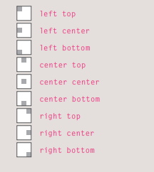

### centering images with css
   * center image : images by default are inline level elements, to center image I have to give it block level display there are 2 ways.
      1. put text-align center on parent box.
      2. give image margin auto right to left and secify width.

#### background-image
   to set background to image use `background-image` property.
    * `background-image:url('images/URL.png')`

  1. background-repeat:
     it has 4 values, repeat, repeat-x, repeat-y, no repeat.
  2. background-attachment: 
     * fixed : keep image on the same position on the page.
     * scroll : image move up and down as the user scroll
  3. background-position : 
     when image is not repeated I can use postion 
      * values : `background-position: center center`
      * values 

  4. **background** it's a shorthand for all previous values and combine them with space between each property.

  * You can specify the dimensions of images using CSS. This is very helpful when you use the same sized images on several pages of your site.
  * Images can be aligned both horizontally and vertically using CSS.
  * You can use a background image behind the box created by any element on a page.
  * Background images can appear just once or be repeated across the background of the box. 
  * You can create image rollover effects by moving the background position of an image.
  * To reduce the number of images your browser has to load, you can create image sprites.

# Search Engine Optimization (SEO).
  * when a user go to google search engine, and search for particular topic, will show x pages number back to user.
  * engine optimization will help my website to appear on top results (basically i am optimizing my website for the search engine).

#### SEO is often split into two areas
   * On-Page Techniques : 
      * I use this method on my webpage.
      * SE heavily depend on keywords on the website.
      * SE look for keywords user enter in SE.
      * including these keywords in my website content will help the SE find my webpage.
      * image alt attribute is important because it tell SE what is the content of the Image.
   * Off-Page Techniques
      * when other websites link to my page will help the page to rank more for the SEO.
      * Search engines look at the words between the opening `<a>` tag and closing `</a>` tag in the link. If the text in the link contains keywords (rather than just click here) it may be considered more relevant.
      * The words that appear in links to your site should also appear in the text of the page that the site links to.

### On-Page Techniques
there are 7 places on each page of the website where i can add keywords to make my page more visable to the SE.
**these words people might search on to find your site**
1.  Page Title (appear on page top in the window bar): and i can add it in head tag.
2. URL / Web Address : the file name is part of the url, use keywords to help find my page.
3. Headings: engine will know that this page is all about that subject.
4. Text : repeat the keywords in the main body of the text at least 2-3 times.
5. Link Text : Use keywords in the text that create links between pages.
6. Image Alt Text : tell SE what is the content of the image.
7.  Page Descriptions : 
     * The description also lives inside the `<head>` element and is specified using a `<meta>` tag.

**Important Note :** Never try to fool search engines! They will penalize you for it. For example, never add text in the same color as the background of the page as they can detect this.

## How to Identify Keywords and Phrases
   1. brainstorm
   2. ogranize
   3. search.
   4. Compare
   5. Refine
   6. Map 
### Off-Page Techniques